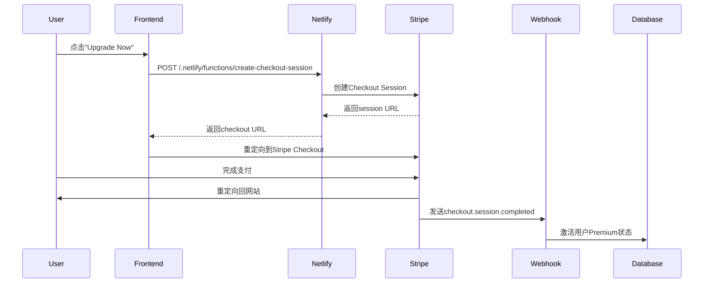

# 支付集成说明

## 概述

项目已成功集成Stripe支付功能，支持两种运行模式：

### 🆓 开源模式（无Stripe配置）
- 所有功能完全免费
- 显示"Support Developer"选项
- 用户可选择性支持项目开发

### 💰 付费模式（配置Stripe）
- 免费版 + Premium付费版
- Premium提供云同步、高级分析等功能
- $6终身买断

---

## 技术架构

### 前端（React + TypeScript）
```
src/
├── services/
│   └── payment.ts           # Stripe支付服务
├── lib/
│   └── config.ts            # 环境检测和功能开关
└── components/
    └── PricingModal.tsx     # 智能定价页面
```

### 后端（Netlify Functions）
```
netlify/functions/
├── create-checkout-session.ts   # 创建支付会话
└── stripe-webhook.ts            # 处理支付回调
```

---

## 环境变量

### 前端（VITE_开头，可在浏览器访问）
- `VITE_STRIPE_PUBLISHABLE_KEY` - Stripe公钥
- `VITE_STRIPE_PRICE_ID` - 产品价格ID

### 后端（仅服务器端）
- `STRIPE_SECRET_KEY` - Stripe密钥（绝密）
- `STRIPE_WEBHOOK_SECRET` - Webhook签名密钥

---

## 支付流程



---

## 功能特性

### ✅ 智能模式切换
- 根据 `config.features.cloudSync` 自动切换显示
- 开源版：显示"Support Developer"
- 付费版：显示"Premium"

### ✅ 环境隔离
- 通过环境变量控制功能启用
- 开源版本不暴露任何支付密钥
- 代码可以完全开源

### ✅ 用户体验
- Stripe托管支付页面
- 支持信用卡、Apple Pay、Google Pay
- 移动端友好
- 多语言支持

### ✅ 安全性
- PCI合规（Stripe处理）
- Webhook签名验证
- HTTPS强制
- 环境变量隔离

---

## 本地开发

### 启动开发服务器
```bash
npm run dev
```

### 测试Netlify Functions（本地）
```bash
# 安装Netlify CLI
npm install -g netlify-cli

# 启动本地开发环境
netlify dev
```

### 测试Webhook（本地）
```bash
# 安装Stripe CLI
brew install stripe/stripe-cli/stripe

# 监听Webhook
stripe listen --forward-to localhost:8888/.netlify/functions/stripe-webhook
```

---

## 部署

### Netlify自动部署

1. 推送代码到GitHub
2. Netlify自动构建和部署
3. 在Netlify Dashboard配置环境变量
4. 在Stripe配置Webhook URL

### 环境变量配置

**Netlify Dashboard → Site settings → Environment variables**

添加所有必需的环境变量（见上面"环境变量"部分）

---

## 测试

### 测试卡号（Stripe提供）

**成功支付：**
```
卡号: 4242 4242 4242 4242
过期: 任何未来日期
CVC: 任何3位数
```

**需要验证：**
```
卡号: 4000 0025 0000 3155
```

**失败支付：**
```
卡号: 4000 0000 0000 9995
```

---

## 监控

### Stripe Dashboard
- 支付记录
- Webhook日志
- 失败原因分析

### Netlify Functions
- 实时日志
- 函数调用统计
- 错误追踪

---

## 待办事项

- [ ] 在Webhook中更新Supabase用户Premium状态
- [ ] 实现支付成功后的确认邮件
- [ ] 添加支付历史记录表
- [ ] 实现退款功能
- [ ] 添加支付统计Dashboard

---

## 相关文档

- [Stripe集成指南](./STRIPE_SETUP.md) - 完整配置步骤
- [Stripe文档](https://stripe.com/docs/checkout/quickstart)
- [Netlify Functions](https://docs.netlify.com/functions/overview/)
