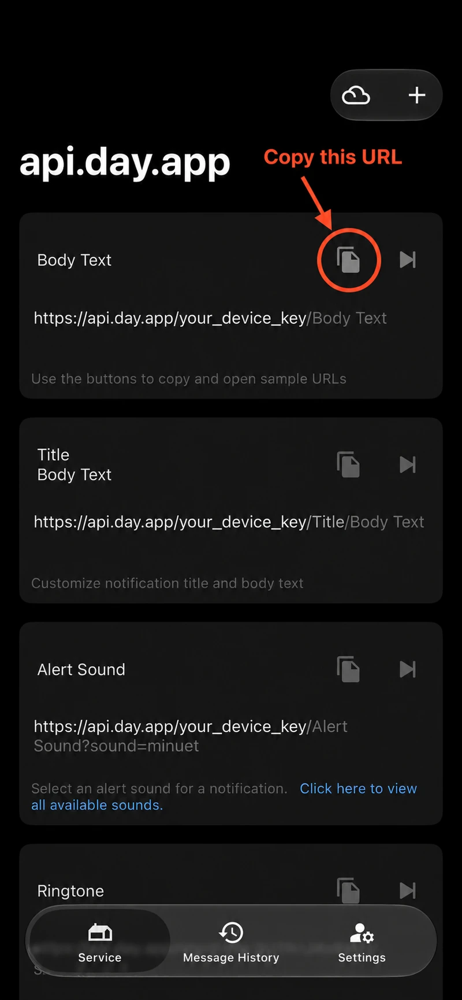
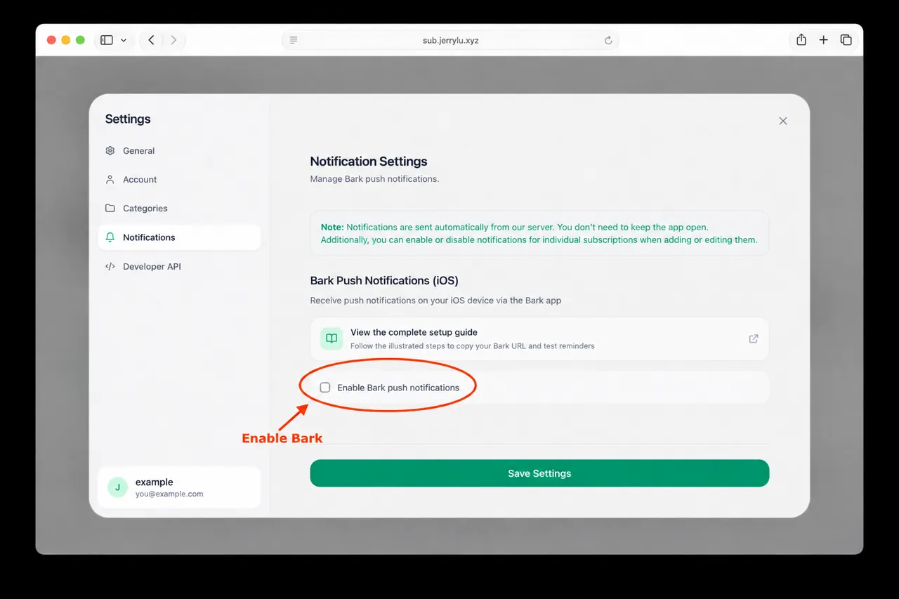
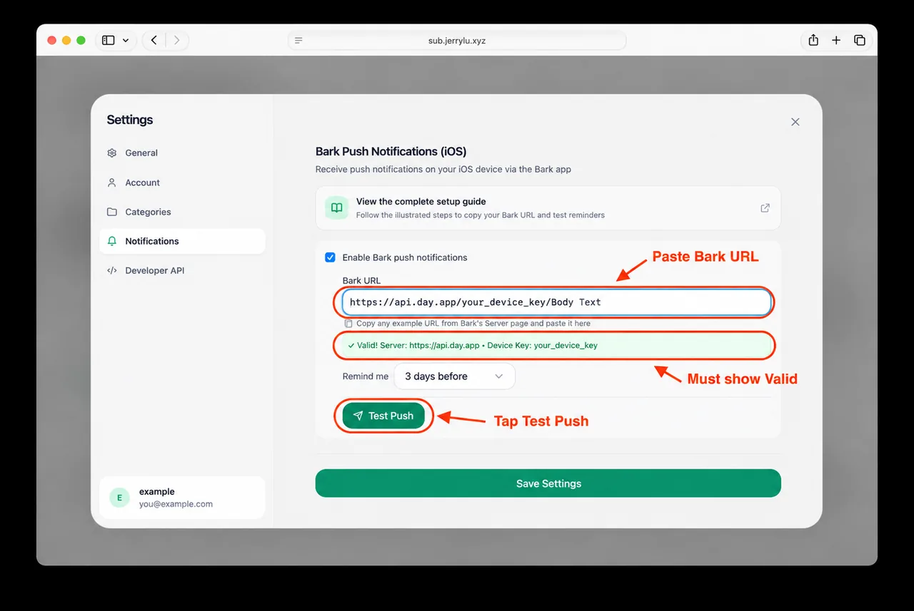
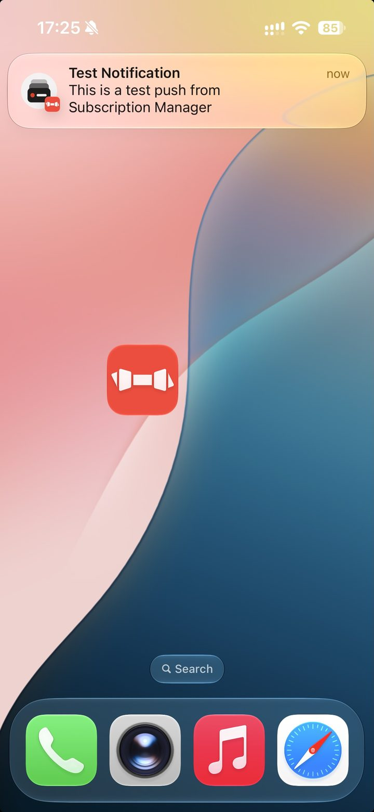

# 使用 Bark 续费与试用提醒

[English](../en/notifications.md) | [简体中文](notifications.md)

Subscription Manager 可以通过 Bark 发送续费提醒和免费试用到期提醒。托管提醒流程使用 Netlify Scheduled Function 和存储在 Supabase 中的通知设置。

## 配置前准备

Bark 是一款免费、开源的 iOS 推送应用。提醒由 Subscription Manager 的服务器自动发送，不需要一直打开网页应用。

开始前请准备：

- 一个已登录的 Subscription Manager 账号；
- 在 iPhone 或 iPad 上安装 [Bark](https://apps.apple.com/app/bark-customed-notifications/id1403753865)；
- Bark 中显示的推送 URL；
- 你希望提前收到提醒的天数（续费或试用结束前）。

> Bark URL 中包含你的 device key。不要把它公开或发送给不信任的人，否则对方可能向你的设备发送推送。

## 获取 Bark URL

1. 在 iOS 设备上下载并打开 Bark。
2. 点击 Bark 底部的 **Service**。
3. 在 Service 页面，点击任意一条示例推送 URL 右侧的复制按钮，例如 `https://api.day.app/your_device_key/Body Text`。
4. 保留完整 URL。Subscription Manager 会自动识别 server URL 和 device key。



> 截图中的 `your_device_key` 等是脱敏占位符，不是真实 device key。请从你自己的 Bark App 复制 URL 并粘贴，不要照抄图片里的示例。

## 在 Subscription Manager 中配置

1. 登录 Subscription Manager。
2. 打开 **设置** → **通知**。
3. 勾选 **启用 Bark 推送通知**。



4. 将刚才复制的完整 Bark URL 粘贴到 **Bark URL** 输入框。确认状态显示 **有效（Valid）**，然后点击 **测试推送（Test Push）**。



5. 确认 iPhone 已收到测试通知。



6. 选择提前提醒的天数（续费或试用结束前），然后点击 **保存设置**。

通知设置会绑定到当前账号。保存或测试推送前必须登录，这样服务器才能把订阅和正确的通知设备对应起来。

## 单个订阅的通知开关

全局启用 Bark 后，你仍可以在添加或编辑订阅时单独开启或关闭提醒。关闭某个订阅的通知不会影响其他订阅。

即使单个订阅仍开启了通知，`paused` 和 `cancelled` 状态也不会发送提醒。

## 免费试用

把订阅标记为免费试用后，提醒按试用结束 / 首次扣费日期发送，而不是按会自动滚动的续费日期。推送和仪表盘文案会说明试用即将结束，方便你决定取消或保留。该日期过期后，不会像普通 `nextPaymentDate` 那样自动向后滚动。

正式（非试用）订阅仍使用现有的下次续费提醒行为。

## 问题排查

如果没有收到提醒：

- 确认 Bark URL 下方显示为有效；
- 确认 Bark 允许系统通知，并尝试在 Bark 内发送示例推送；
- 确认你已登录且保存了通知设置；
- 确认该订阅启用了通知；
- 确认下一次付款日期（或试用结束日期）有效且在未来；
- 如果使用自托管 Bark，确认 server URL 可以从公网访问；
- 再次点击 **测试推送**，区分设备配置问题与定时任务问题。

## 部署方需要的托管服务

- Supabase，用于保存通知设置和订阅
- Netlify Functions，用于定时检查
- Bark 官方服务器或自托管 Bark 服务器

## 必需环境变量

```bash
VITE_SUPABASE_URL=
VITE_SUPABASE_ANON_KEY=
SUPABASE_SERVICE_ROLE_KEY=
```

新部署优先使用 `SUPABASE_SECRET_KEY`。旧变量名 `SUPABASE_SERVICE_ROLE_KEY` 仍作为兼容别名支持。

## SQL 设置

通知相关表和约束已经包含在当前 Supabase migrations 中。新部署使用：

```text
supabase/migrations/20260615000100_baseline.sql
supabase/migrations/20260615000200_harden_existing_schema.sql
supabase/migrations/20260916000100_subscription_trials.sql
```

旧安装说明和 legacy migration 文件仅保留在 `supabase/legacy/` 中作为历史参考。

## 定时函数

定时函数位于：

```text
netlify/functions/send-scheduled-notifications.ts
```

它会检查符合条件的订阅，发送 Bark 消息，记录发送历史，并避免重复发送。

## 本地测试

```bash
npm run test:notifications
```

测试完整 function 运行环境时使用 Netlify Dev：

```bash
npm run dev:full
```
